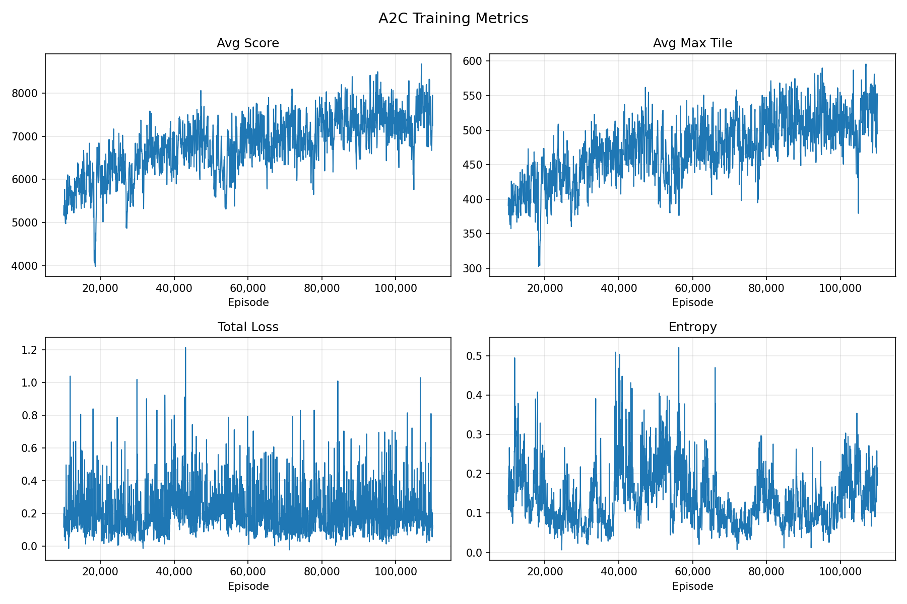
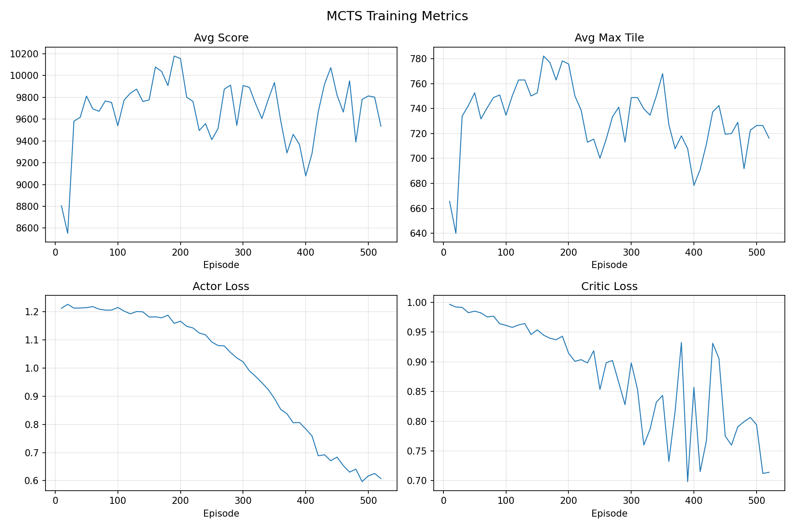
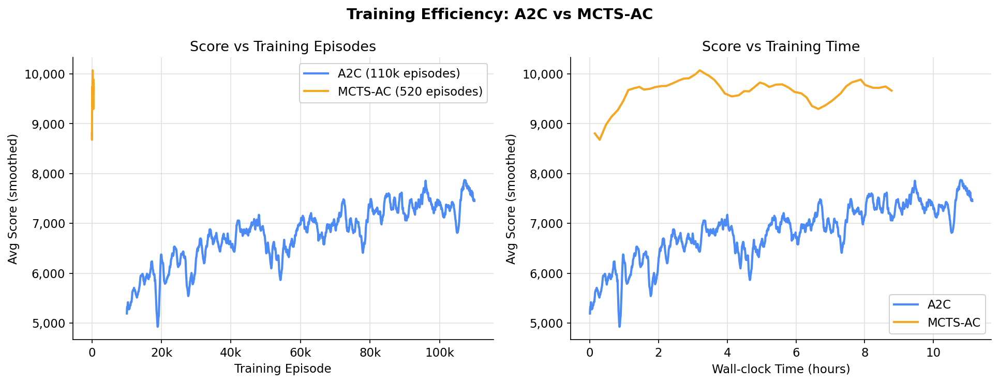
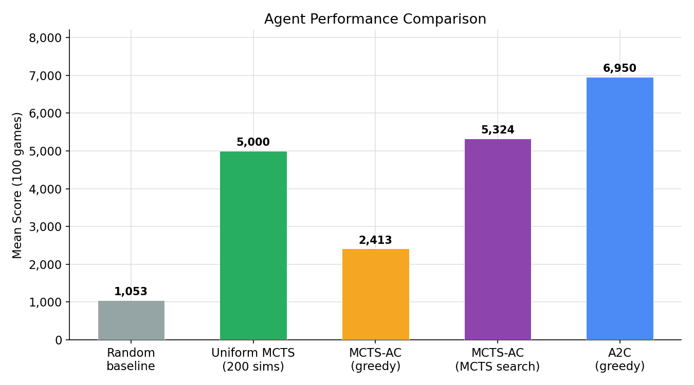

# 2048 Actor-Critic Learning

Teaching an agent to play 2048 using reinforcement learning. Two training algorithms are implemented and compared:

- **A2C** — Advantage Actor-Critic with a CNN backbone (fast to train, good baseline)
- **MCTS-AC** — AlphaZero-style MCTS guided by a trained LinearActorCritic network

A pure-MCTS diagnostic agent (**UniformMCTS**) is also included, which uses no neural network and serves as a strong search-only baseline.

---

## Key Findings

### 1. Pure MCTS is already a strong baseline — but it's slow

Without any neural network, UniformMCTS with random rollouts can play well given enough simulations and rollout depth. The search alone develops reasonable game strategy by exploring future states. The catch: every move requires hundreds of tree simulations, making play slow.

### 2. A2C learns a fast greedy policy, but training is long

A2C distills game strategy into a CNN. Once trained, inference is a single forward pass — essentially instant. Training takes tens of thousands of episodes to converge, but the result is an agent that plays in real time.



### 3. MCTS-AC trains even slower, but learns a better policy

MCTS-AC trains a network to imitate MCTS search output rather than raw game rewards. Each episode runs full MCTS to generate move targets, so data collection is slow. But the learned policy is higher quality because it is trained on search-quality decisions.



The chart below shows both agents over training time — MCTS-AC achieves higher scores with far fewer episodes, but each episode takes much longer because MCTS runs on every move during training.



### 4. MCTS + trained policy gives the best results

The strongest configuration is running MCTS at evaluation time using the trained MCTS-AC network as the policy and value prior. The network guides the tree toward promising moves, and the search evaluates the next several steps before committing.



> The MCTS-AC greedy score being lower than A2C's is expected — the MCTS-AC network was trained to output search-quality distributions, not greedy-optimal ones. It shines when paired with live MCTS search.

### 5. Sims vs. speed is the core tradeoff

More MCTS simulations per move → better play, but proportionally slower. At 200 sims a game takes minutes; the greedy policy runs in real time. Choosing how many sims to run is the main lever for tuning the quality/speed balance.


---

## Installation

**Requirements:** Python 3.10+, pip, git

```bash
git clone https://github.com/BradenMeyers/2048ActorCriticLearning.git
cd 2048ActorCriticLearning
bash setup_env.sh        # creates .venv and installs dependencies
source .venv/activate
```

**GPU (recommended for training):** Install PyTorch for your CUDA version from [pytorch.org](https://pytorch.org/get-started/locally/) before running `setup_env.sh`, or replace the torch line in `requirements.txt` with the appropriate index URL.

```bash
# Example for CUDA 12.8
pip install torch --index-url https://download.pytorch.org/whl/cu128
```

---

## Quick start

All modes are accessed through `main.py --mode <mode>`.

```bash
python main.py --help
```

Because training takes so long, pretrained `a2c_checkpoint.pt` and `mcts_checkpoint.pt` weights are provided to evaluate right away.

---

## Evaluation

### Random Policy
```bash
# Random baseline
python main.py --mode evaluate --agent baseline --games 100
```

```
  Random baseline — 100 games
==================================================
  Mean score      :     1052.9
  Median score    :     1016.0
  Max score       :       3044
  Win rate (≥2048):     0.0%
  Duration        : 1.47s

  Max tile distribution:
       16:                                          1.0%
       32: █                                        2.0%
       64: ██████████████████████                   44.0%
      128: ███████████████████████                  47.0%
      256: ███                                      6.0%

```


### Greedy evaluation (fast)

```bash
# A2C agent
python main.py --mode evaluate --agent a2c --games 100
```

```
  A2C (greedy) — 100 games
==================================================
  Mean score      :     6950.4
  Median score    :     6466.0
  Max score       :      17128
  Win rate (≥2048):     0.0%
  Duration        : 28.07s

  Max tile distribution:
      128: ██                                       5.0%
      256: ████████████                             25.0%
      512: ████████████████████████████             57.0%
     1024: ██████                                   13.0%
```

```bash
# MCTS-AC agent, greedy policy
python main.py --mode evaluate --agent mcts --eval-type greedy --games 100
```

```
  MCTS-AC (greedy) — 100 games
==================================================
  Mean score      :     2413.3
  Median score    :     2294.0
  Max score       :       5092
  Win rate (≥2048):     0.0%
  Duration        : 11.11s

  Max tile distribution:
       64: ████                                     8.0%
      128: ██████████████████████                   45.0%
      256: ██████████████████████                   45.0%
      512: █                                        2.0%
```

### MCTS with and without policy (slow)

> **Note:** The results below did not come from the exact commands listed — MCTS evaluation is slow. Commands provided run a smaller number of games.

```bash
# MCTS-AC agent, full MCTS search at eval time
python main.py --mode evaluate --agent mcts --eval-type mcts --eval-sims 200 --games 2
```
<!-- # TODO  ADD EVALUATION of more games --> 

```
MCTS-AC (mcts) — 2 games
Mean score      :     5324.0
Median score    :     5324.0
Max score       :     6640.0
Win rate (≥2048):      0.0%
Duration        :   101.31s

Max tile distribution:
    256: 50.0%
    512: 50.0%
```

```bash
# Uniform MCTS (no network)
python main.py --mode evaluate --agent uniform --sims 200 --games 100 --rollout 10
```


---

## Watching an agent play

```bash
# A2C agent
python main.py --mode display --agent a2c

# MCTS-AC agent (greedy policy)
python main.py --mode display --agent mcts

# MCTS-AC agent (search with mcts, slower)
python main.py --mode display --agent mcts --display-type mcts --n-simulations 100

# UniformMCTS (no network - mcts only)
python main.py --mode display --agent uniform --sims 200
```

Human play:

```bash
python main.py --mode gui        # pygame window, arrow keys
python main.py --mode terminal   # terminal, arrow keys
```

---


## Training

### A2C (CNN)

```bash
python main.py --mode train_a2c
```

Key options:

| Flag | Default | Description |
|------|---------|-------------|
| `--episodes` | 2000 | Training episodes |
| `--lr` | 3e-4 | Learning rate |
| `--gamma` | 0.99 | Discount factor |
| `--entropy-coef` | 0.01 | Entropy regularization |
| `--value-coef` | 0.5 | Critic loss weight |
| `--checkpoint` | `a2c_checkpoint.pt` | Save path |
| `--log-every` | 50 | Print interval |

Produces: `a2c_checkpoint.pt`, `a2c_log.csv`

**Reproduce the best A2C run** (from `runs/110k`):

```bash
python main.py --mode train_a2c --episodes 110000 --lr 3e-4 --entropy-coef 0.01
```


---

### MCTS-AC (AlphaZero-style)

```bash
python main.py --mode train_mcts
```

Key options:

| Flag | Default | Description |
|------|---------|-------------|
| `--episodes` | 2000 | Training episodes |
| `--n-simulations` | 50 | MCTS sims per move |
| `--collect-every` | 10 | Episodes per training round |
| `--n-grad-steps` | 3 | Gradient steps per round |
| `--minibatch` | 512 | Replay buffer sample size |
| `--terminal-penalty` | 0.0 | Extra reward at game-over |
| `--checkpoint` | `mcts_checkpoint.pt` | Save path |
| `--dir` | (cwd) | Output directory |

Produces: `mcts_checkpoint.pt`, `mcts_log.csv`

**Reproduce the best MCTS-AC run**:

```bash
python main.py --mode train_mcts --episodes 5000 --n-simulations 100 \
     --lr 5e-5 --dir runs/repro
```

Training resumes automatically from a checkpoint if one exists in `--dir`.


---


## Parameter sensitivity analysis (UniformMCTS)

Runs a one-at-a-time sensitivity sweep across key MCTS parameters in parallel threads and prints a ranked results table.

```bash
python sensitivity_analysis.py --games 20 --sims 200
```

Options:

| Flag | Default | Description |
|------|---------|-------------|
| `--games` | 20 | Games per config |
| `--sims` | 200 | MCTS simulations per move |
| `--seed` | 42 | Base RNG seed (same for all configs) |
| `--workers` | 8 | Parallel threads |

Parameters swept: `c`, `rollout_depth`, `gamma`, `terminal_penalty`, `reuse_tree`.

**Key findings from preliminary sweep (3 games, 20 sims):**

| Parameter | Sweet spot | Notes |
|-----------|-----------|-------|
| `c` (exploration) | ~80 | Default 160 is slightly too high |
| `rollout_depth` | 50–100 | Longer rollouts help significantly |
| `gamma` | 0.99 | Base value is already near-optimal |
| `terminal_penalty` | -1 to 0 | Large negatives hurt; tree becomes overly conservative |
| `reuse_tree` | False | Resetting per move wins over reusing |

---

## Plotting training curves

```bash
python plot_log.py a2c_log.csv
python plot_log.py runs/n100_tp25/mcts_log.csv runs/a2c/a2c_log.csv
```

Saves `a2c_training.png` in the current directory.

---

## Project structure

```
game.py              — 2048 game engine (Game2048, Move)
networks.py          — CNNActorCritic, LinearActorCritic
utils.py             — reward functions, compute_returns, action_mask, RunningNormalizer
MCTS.py              — BaseMCTS, MCTS, UniformMCTS, Node
train_a2c.py         — A2C training loop (importable, no CLI)
train_mcts.py        — MCTS-AC training loop (importable, no CLI)
mcts_uniform.py      — UniformMCTS standalone runner
evaluate.py          — shared evaluation logic (evaluate_agent, print_results)
display.py           — shared pygame rendering (display_agent)
main.py              — unified CLI entry point for all modes
sensitivity_analysis.py — parallel parameter sweep for UniformMCTS
plot_log.py          — plot training CSV logs
gui.py               — interactive pygame game (human play)
terminal_ui.py       — interactive curses game (human play)
```

---

## Architecture summary

| | A2C | MCTS-AC | UniformMCTS |
|---|---|---|---|
| Network | CNNActorCritic | LinearActorCritic | None |
| State encoding | log2 → (1,4,4) spatial | one-hot → (256,) flat | — |
| Training | online A2C | replay buffer + frozen target | — |
| Move selection | greedy / sampled | MCTS + network | MCTS + random rollout |
| Leaf evaluation | — | critic value head | random rollout |
